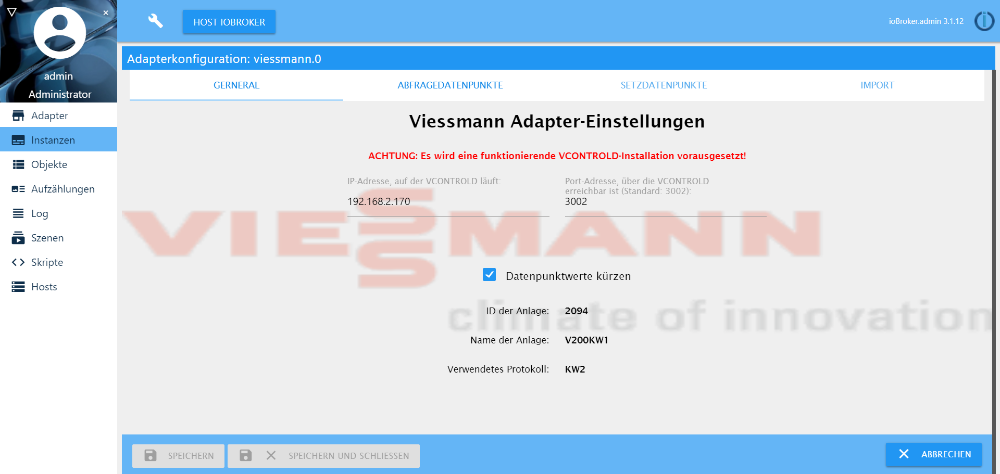
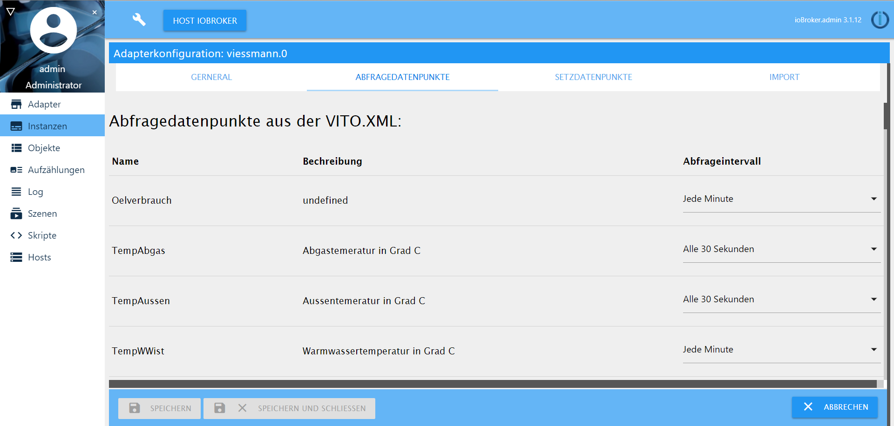

# ioBroker.viessmann
=================

[](https://www.npmjs.com/package/iobroker.viessmann)
[](https://www.npmjs.com/package/iobroker.viessmann)

[](https://nodei.co/npm/iobroker.viessmann/)

Mit diesem Adapter ist es möglich, Werte aus einer Viessmann Steuerung
die mit dem Programm [Vcontrold](https://github.com/openv/vcontrold) kommuniziert,
in Objekten zu speichern. Ebenso ist das Setzen von Werten, die man in seiner Vito.xml konfiguriert hat möglich.


## Neu: 	
Um die Kommandos aus der VITO.XML einzulesen, ist es nötig, diese in das Adapter Verzeichnis zu kopieren *(../iobroker/node_modules/iobroker.viessmann)*. Nach dem Starten der Instanz, wird diese dann automatisch eingelesen. Des Weiteren ist es möglich diese als JSON einzulesen. Das umwandeln ist z.B. [HIER](http://www.utilities-online.info/xmltojson/#.WFVQv_DhA1I) möglich!
Den umgewandelten Inhalt der Datei, dann mittels, z.B.mit STRG+C, in das Importfenster importieren.

Die Struktur der vito.xml muss in der folgenden Form aufgebaugt sein:

		```<vito>
			<devices>
				<device ID="2094" name="V200KW1" protocol="KW2"/>
			</devices>
			<commands>
				<command name='getOelverbrauch' protocmd='getaddr' >
					<addr>7574</addr>
					<len>4</len>
					<description></description>
				</command>
				<command name='getTempAbgas' protocmd='getaddr'>
					<addr>0808</addr>
					<len>2</len>
					<unit>UT</unit>
					<error>05 05</error>
					<description>Abgastemeratur in Grad C</description>
				</command>
			</commands>
		</vito>```


## Wichtig!: 	
	- Bei jedem neuen einlesen der JSON Daten, werden ggf. die "alten" Einstellungen gelöscht.
	- Das einlesen der Vito.xml findet nur statt, wenn die Instanz noch keine Konfiguration hat.

Es ist empfehlenswert, bei relativ unwichtigen Abfragewerten, ein möglichst grosses Abfrageintervall zu wählen.


*Bitte erst die JSON einlesen und dann die Netzwerkeinstellungen im Adapter ändern.*  

*die benutzten Bilder stammen von www.viessmann.com.*
### Changelog

#### 0.4.0 (28.01.2018)
* (misanorot) parse vito.xml file

#### 0.3.0 (22.01.2018)
* (misanorot) ready for admin V3

#### 0.2.6
* (misanorot) add option to use format values

#### 0.0.1
* (misanorot) initial release

### License

The MIT License (MIT)

Copyright (c) 2017-2018 misanorot <audi16v@gmx.de>

Permission is hereby granted, free of charge, to any person obtaining a copy
of this software and associated documentation files (the "Software"), to deal
in the Software without restriction, including without limitation the rights
to use, copy, modify, merge, publish, distribute, sublicense, and/or sell
copies of the Software, and to permit persons to whom the Software is
furnished to do so, subject to the following conditions:

The above copyright notice and this permission notice shall be included in
all copies or substantial portions of the Software.

THE SOFTWARE IS PROVIDED "AS IS", WITHOUT WARRANTY OF ANY KIND, EXPRESS OR
IMPLIED, INCLUDING BUT NOT LIMITED TO THE WARRANTIES OF MERCHANTABILITY,
FITNESS FOR A PARTICULAR PURPOSE AND NONINFRINGEMENT. IN NO EVENT SHALL THE
AUTHORS OR COPYRIGHT HOLDERS BE LIABLE FOR ANY CLAIM, DAMAGES OR OTHER
LIABILITY, WHETHER IN AN ACTION OF CONTRACT, TORT OR OTHERWISE, ARISING FROM,
OUT OF OR IN CONNECTION WITH THE SOFTWARE OR THE USE OR OTHER DEALINGS IN
THE SOFTWARE.
